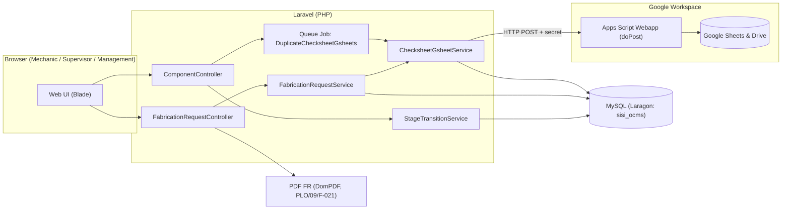
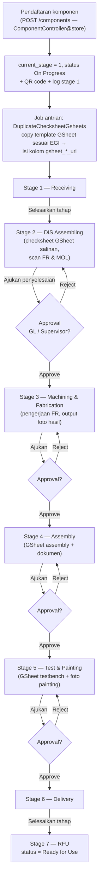
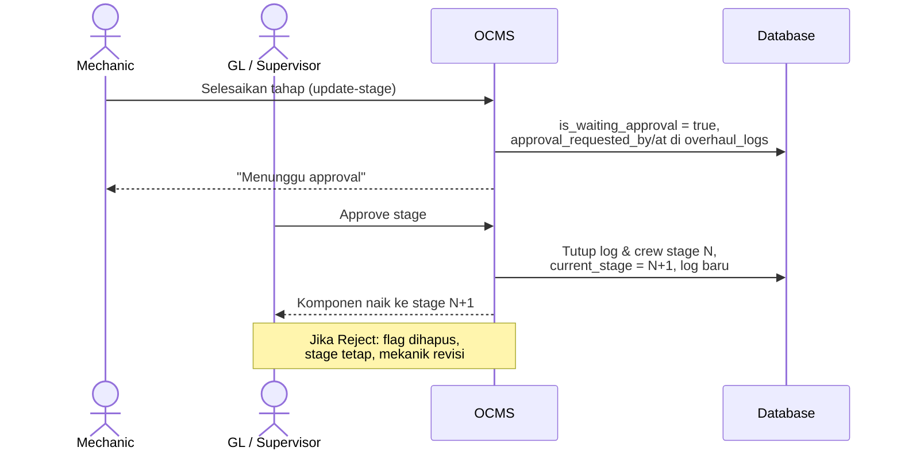
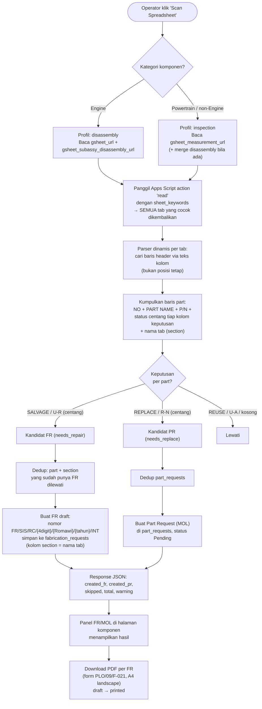
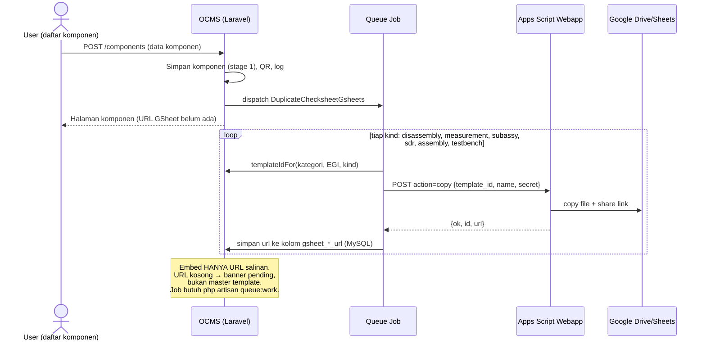
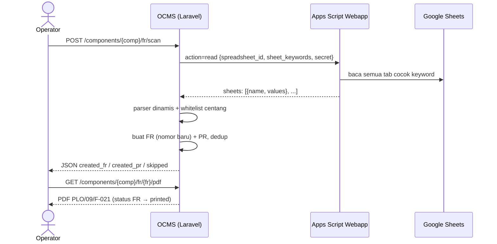
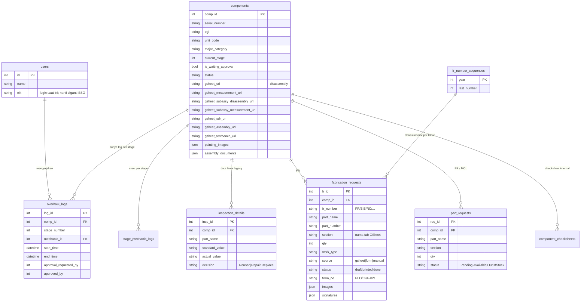

# SISI-OCMS — Dokumen Workflow Sistem

**Overhaul Component Management System (OCMS)**
Dokumen ini menjelaskan secara detail cara kerja aplikasi: alur overhaul komponen stage 1–7, otomasi Fabrication Request (FR) / Part Request (PR/MOL), dan integrasi Google Sheets (Apps Script).

Ditujukan untuk tim Head Office sebagai referensi konversi ke .NET Core + SQL Server.

**Stack saat ini (bukan target konversi):** Laravel (PHP) + **MySQL 8** Laragon (`sisi_ocms` di `127.0.0.1:3306`). Antrian job GSheet: `QUEUE_CONNECTION=database` — butuh `php artisan queue:work`. Tes otomatis memakai SQLite di memori (`phpunit.xml`), terpisah dari app yang jalan.

---

## Daftar Isi

1. [Gambaran Umum Sistem](#1-gambaran-umum-sistem)
2. [Aktor & Hak Akses (Role)](#2-aktor--hak-akses-role)
3. [Workflow Utama: Overhaul Stage 1–7](#3-workflow-utama-overhaul-stage-17)
4. [Detail Per Stage](#4-detail-per-stage)
5. [Workflow Auto-FR / PR (Stage 2)](#5-workflow-auto-fr--pr-stage-2)
6. [Cara Kerja Parser Keputusan (Dinamis)](#6-cara-kerja-parser-keputusan-dinamis)
7. [Integrasi Google Sheets — Apps Script](#7-integrasi-google-sheets--apps-script)
8. [Penomoran Dokumen](#8-penomoran-dokumen)
9. [Skema Database](#9-skema-database)
10. [Peta File Kode (untuk tim konversi)](#10-peta-file-kode-untuk-tim-konversi)

---

## 1. Gambaran Umum Sistem

OCMS mengelola siklus **overhaul komponen alat berat** (Engine, Powertrain: Control Valve, Hydraulic Cylinder, Suspension, dll.) dari penerimaan sampai siap pakai, melalui **7 stage** dengan gerbang approval.

Tiga pilar utama:

| Pilar | Fungsi |
|---|---|
| **Workflow Stage 1–7** | Tracking posisi komponen, log pengerjaan, approval atasan per stage |
| **Checksheet Google Sheets** | Tiap komponen otomatis dibuatkan salinan spreadsheet checksheet (disassembly, measurement, assembly, testbench) dari template master sesuai EGI/model unit |
| **Auto-FR / PR** | Sistem membaca centang keputusan mekanik di spreadsheet dan otomatis menerbitkan dokumen **Fabrication Request (form PLO/09/F-021)** untuk part yang diperbaiki, dan **Part Request (MOL)** untuk part yang diganti baru |

Arsitektur saat ini:



> Pada konversi .NET: kotak **Laravel** diganti ASP.NET Core, **MySQL** diganti SQL Server, penyimpanan file (PDF/foto/xlsx) pindah ke Azure Blob Storage, login lokal dihapus (SSO Microsoft di depan aplikasi). Kotak **Google Workspace tidak berubah** — webapp dipanggil via HTTP biasa.

---

## 2. Aktor & Hak Akses (Role)

Sumber: `app/Support/OcmsAccess.php`, dicek lewat method di model `User`.

| Role | Daftar komponen | Proses stage | Approve/Reject stage | FR / MOL | Kelola user & template |
|---|:--:|:--:|:--:|:--:|:--:|
| **Mechanic** | ✔ | ✔ | ✖ | ✔ | ✖ |
| **Group Leader** | ✔ | ✔ | ✔ | ✔ | ✖ |
| **Supervisor** | ✔ | ✔ | ✔ | ✔ | ✖ |
| **Dept/CRC/Section/Logistic Head, Planner** (FULL_ACCESS) | ✔ | ✔ | ✔ | ✔ | ✖ |
| **Logistik** | ✔ | ✖ (review saja) | ✖ | ✖ | ✖ |
| **Developer** | ✔ | ✖ | ✖ | ✖ | ✔ (template, edit/hapus komponen) |
| **SuperAdmin** | ✔ | ✔ | ✔ | ✔ | ✔ |

Autentikasi saat ini: login **NIK + password** (Laravel Fortify + Spatie Permission).
Target konversi: **tanpa login lokal** — identitas & role disuntik lewat SSO Microsoft (Entra ID); pemetaan role di atas nantinya ke grup AD.

---

## 3. Workflow Utama: Overhaul Stage 1–7

Nama stage (sumber: `ComponentController::STAGE_NAMES`):

| Stage | Nama | Approval untuk lanjut? |
|:--:|---|:--:|
| 1 | Receiving (Penerimaan DC) | Tidak — auto lanjut |
| 2 | DIS Assembling (Pembongkaran, Pencucian & Pengukuran) | **Ya** |
| 3 | Machining & Fabrication (Perbaikan) | **Ya** |
| 4 | Assembly (Perakitan) | **Ya** |
| 5 | Test Performance & Painting (Uji Fungsi & Pengecatan) | **Ya** |
| 6 | Delivery (Serah Terima) | Tidak — auto lanjut |
| 7 | RFU (Ready for Use) | — (status akhir) |

### Flowchart siklus hidup komponen



### Mekanisme transisi stage

Semua transisi lewat `StageTransitionService`:

1. **Selesaikan tahap** (`POST /components/{comp}/update-stage`, `ComponentController@updateStage`):
   - Stage **1 dan 6** → langsung `advance()` (naik 1 stage, tanpa approval).
   - Stage **2–5** → `requestApproval()`: set flag `is_waiting_approval`, catat siapa yang mengajukan. Stage **belum naik**.
2. **Approve** (`POST /components/{comp}/approve-stage`, hanya role approver) → `advance(approvedBy: user)`:
   - Tutup `overhaul_logs` & `stage_mechanic_logs` stage berjalan (clock-out crew).
   - `current_stage + 1`, buat log baru, siapkan checksheet stage berikut (`ensureChecksheetForStage`).
   - Jika sampai stage 7 → status komponen `Ready for Use`.
3. **Reject** (`POST /components/{comp}/reject-stage`) → hapus flag waiting, stage tetap, mekanik memperbaiki lalu mengajukan ulang.

Semua operasi dibungkus transaksi DB + lock baris komponen (`lockComponent`) agar dua user tidak memproses bersamaan.

### Sequence diagram approval (stage 2–5)



---

## 4. Detail Per Stage

### Stage 1 — Receiving

- Input identitas komponen: `serial_number`, `egi`, `unit_code`, `major_category` (Engine / Powertrain sub-kategori), SMR, manifest, way bill, RO number, dsb.
- Sistem membuat **QR code** komponen dan checksheet Receiving.
- Di belakang layar, job antrian menyalin **semua template GSheet** yang relevan untuk EGI tersebut (disassembly, measurement, subassy, SDR, assembly, testbench) — hasil salinannya disimpan sebagai URL di kolom `gsheet_*_url` komponen. Kalau job belum selesai/gagal, halaman komponen akan men-dispatch ulang otomatis saat dibuka.

### Stage 2 — DIS Assembling (jantung sistem)

Satu jalur resmi: **Google Sheets salinan per komponen** (bukan master template, bukan form inspeksi digital).

Mekanik membuka checksheet GSheet yang di-embed di halaman komponen, mengisi hasil bongkar/ukur, dan **mencentang checkbox keputusan** di baris part:

| Kategori | Spreadsheet yang discan | Keputusan | Akibat |
|---|---|---|---|
| Engine | Disassembly (+ subassy disassembly) | REUSE | tidak ada dokumen |
| | | **SALVAGE** | **FR** (part diperbaiki) |
| | | **REPLACE** | **PR/MOL** (minta part baru) |
| Powertrain | Inspection/Measurement | U/A (use again) | tidak ada dokumen |
| | | **U/R** (use with repair) | **FR** |
| | | **R/N** (replace new) | **PR/MOL** |

Lalu operator menekan **Scan Spreadsheet** → sistem membaca semua tab relevan dan langsung membuat FR + PR (detail di §5).

Jika `gsheet_*_url` masih kosong (job copy belum selesai / secret Apps Script salah): halaman menampilkan banner **“Salinan sedang disiapkan”**. Iframe **tidak** boleh mengarah ke master template. Form Inspeksi Digital (Crankshaft / Piston Ring / Cylinder Liner) **sudah dihapus**.

Catatan: **Engine Measurement bukan sumber FR** — hanya data ukuran. FR Engine tetap dari Disassembly (SALVAGE).

### Stage 3 — Machining & Fabrication

- Daftar FR hasil stage 2 dikerjakan (fabrikasi/machining). Tombol scan FR/MOL juga masih tersedia di stage ini.
- FR bisa dicetak PDF (form PLO/09/F-021); status FR: `draft` → `printed` (otomatis saat PDF dibuka) → `done`.
- Output pekerjaan (foto hasil) dilampirkan ke FR.

### Stage 4 — Assembly

- Checksheet GSheet assembly (`gsheet_assembly_url`) + upload dokumen assembly.

### Stage 5 — Test Performance & Painting

- Checksheet GSheet testbench (`gsheet_testbench_url`) + upload foto painting (`painting_images`).

### Stage 6 — Delivery → Stage 7 — RFU

- Serah terima; menyelesaikan stage 6 langsung menaikkan ke stage 7 dan status komponen menjadi **Ready for Use**.

> Validasi checksheet internal **di-skip** di stage 2 (selalu, karena checksheet resmi = GSheet), serta stage 4/5 bila salinan `gsheet_assembly_url` / `gsheet_testbench_url` sudah ada.

---

## 5. Workflow Auto-FR / PR (Stage 2)

Endpoint: `POST /components/{component}/fr/scan` → `FabricationRequestController@scan`. Prinsip: **1 FR = 1 part**.



Poin penting perilaku:

- **Scan langsung menyimpan** (bukan sekadar preview): `scanCandidates()` → `createFromCandidates()` + `createPartRequestsFromCandidates()`.
- **Dedup per `part_name + section`** — part bernama sama di tab berbeda (mis. valve NO1 vs NO2) tetap jadi FR terpisah, tapi scan ulang tidak menduplikasi.
- Scan masih menyapu sisa baris `inspection_details` lama (data historis, form digital sudah tidak dipakai) berkeputusan Repair/Replace yang belum punya FR/PR.
- Jalur alternatif: **Form FR Kosong** (`components.fr.create` → `storeSingle`, source `manual`) untuk FR di luar hasil scan.
- FR punya field `source`: `gsheet` / `form` (data lama) / `manual`.

---

## 6. Cara Kerja Parser Keputusan (Dinamis)

Lokasi: `app/Services/ChecksheetGsheetService.php`. Prinsip: **cari header berdasarkan teks, bukan posisi kolom** — kolom REUSE di kolom U pada satu file dan kolom W di file lain sama-sama valid.

### Profil Engine — `parseDisassemblyValues()`

1. Telusuri baris demi baris mencari **baris header** yang memuat teks: `NO`, `PART`/`PARTS NAME`, `PART NUMBER`/`P/N`, `REUSE`/`REUSED`, `SALVAGE`/`SALVG`, `REPLACE`.
2. Simpan indeks kolom yang ditemukan.
3. Baris di bawah header yang punya **NO + nama part** dianggap **baris part utama** (sub-baris check point diabaikan — keputusan hanya dibaca di baris part).
4. Nilai sel di kolom SALVAGE/REPLACE dicek dengan **whitelist centang**.

### Profil Powertrain — `parseInspectionValues()`

1. Cari header `NO`, `PARTS NAME`, opsional `PART NUMBER`.
2. Kolom keputusan dari **sub-header** `U/A | U/R | R/N` (boleh di baris terpisah di bawah header utama; variasi `UR`/`RN` diterima).
3. Fallback: kalau hanya ada satu kolom `DECISION`, isinya dibaca sebagai teks (`U/R` → FR, `R/N` → PR).

### Deteksi centang — `isDecisionChecked()`

Whitelist, bukan "sel tidak kosong": boolean `TRUE`, angka `1`, teks `x`, `✓`, `v`, `yes`, `checked`, dll. Teks bebas seperti `N/A`, `OK`, atau catatan **tidak** dianggap centang (mencegah FR palsu). Sel kosong = tidak dicentang.

### Multi-tab

Semua tab yang namanya mengandung keyword dibaca dan diproses:

- Disassembly: `disassy`, `diss`, `disassembly`, `engine`
- Inspection: `inspeksi`, `inspection`, `measurement`

Nama tab dibawa di setiap baris hasil dan disimpan ke kolom **`section`** di FR/PR.

---

## 7. Integrasi Google Sheets — Apps Script

File: `tools/gsheet_copy_webapp.gs`, di-deploy sebagai **Web App** (`doPost`, URL `/exec`). Laravel memanggilnya lewat `ChecksheetGsheetService::postWebapp()` dengan konfigurasi:

```env
GSHEET_COPY_WEBAPP_URL=  # URL /exec hasil deploy
GSHEET_COPY_SECRET=      # harus sama dengan Script Property OCMS_SECRET
```

Keamanan: secret disimpan di **Script Properties** (bukan hardcode), dibandingkan constant-time; Laravel **fail-closed** (menolak jalan bila URL/secret kosong) dan hanya mengizinkan action pada allow-list. Aksi baca dibatasi hanya untuk spreadsheet yang dikelola OCMS (`isManagedSpreadsheetId`).

### Action runtime

| Action | Parameter utama | Fungsi |
|---|---|---|
| `copy` | `template_id`, `name`, `secret` | Salin template master → folder Drive `OCMS Checksheet Copies`, share anyone-with-link (edit), kembalikan `{id, url}` |
| `read` | `spreadsheet_id`, `sheet_keywords` (atau `sheet`), `secret` | Kembalikan **semua tab** yang namanya cocok keyword: `sheets: [{name, values}, …]`; tanpa match → fallback tab pertama dengan flag `matched: false` |
| `upload` | `filename`, `subdir`, `data` (xlsx base64), `secret` | Upload xlsx → dikonversi jadi Google Spreadsheet |
| `ping` | `secret` | Health check akses Drive |

Action admin (nonaktif secara default, flag `OCMS_ADMIN_ACTIONS`): `apply_checkboxes`, `apply_decision_merges`, `apply_decision_boxes`, `list_revisions`, `restore_revision`, `restore_from_xlsx`.

### Sequence: pendaftaran komponen → checksheet siap



### Sequence: scan keputusan → FR/PR



Pemetaan template master per **kategori + EGI** ada di `config/checksheet_gsheets.php` (bisa dioverride dari DB `gsheet_templates`): `disassembly_templates`, `measurement_templates`, `subassy_*_templates`, `sdr_templates`, `assembly_templates`, `testbench_templates`, dengan fallback `default`.

> **Penting operasional:**
> 1. Setiap perubahan `gsheet_copy_webapp.gs` wajib **Deploy → New version**.
> 2. `OCMS_SECRET` (Script Properties) harus **sama** dengan `GSHEET_COPY_SECRET` di `.env`. Deploy versi baru **tidak** menyamakan secret.
> 3. Worker antrian harus jalan (`php artisan queue:work`). Tanpa itu URL salinan tetap kosong.

---

## 8. Penomoran Dokumen

### Fabrication Request

Format: `FR/SIS/RC/{4 digit urut}/{bulan Romawi}/{tahun}/INT` — contoh: `FR/SIS/RC/0475/VII/2026/INT`.

- Nomor urut per **tahun**, dikelola tabel `fr_number_sequences` (`year`, `last_number`) dengan **lock DB** saat alokasi (`allocateNextNumber`) agar tidak ada nomor kembar walau dua user scan bersamaan.
- Nomor manual dari luar sistem bisa disinkronkan (`syncSequenceFromManualNumber`) supaya urutan tidak tabrakan.
- Form PDF: **PLO/09/F-021**, A4 landscape, field default di `FabricationRequest::FORM_DEFAULTS`.

### Part Request (MOL)

Tidak bernomor otomatis; dicatat di `part_requests` dengan status `Pending` / `Available` / `Out of Stock` untuk ditindaklanjuti logistik.

---

## 9. Skema Database

Engine: **MySQL 8** (`sisi_ocms`). Semua service (`StageTransitionService`, `FabricationRequestService`, `ChecksheetGsheetService`) memakai koneksi default Laravel — tidak ada cabang SQLite di kode aplikasi.



Tabel pendukung lain: `component_checksheets` (checklist internal per stage), `checksheet_templates` & `gsheet_templates` (master), `stage_mechanic_logs` (man-hour crew), `spreadsheet_layouts` + `component_spreadsheet_answers` (checksheet lokal hasil impor xlsx), tabel Spatie roles/permissions.

---

## 10. Peta File Kode (untuk tim konversi)

| Area | File Laravel | Isi |
|---|---|---|
| Workflow stage | `app/Http/Controllers/ComponentController.php` | store, show, updateStage, approveStage, rejectStage (stage 2 = GSheet, tanpa form digital) |
| | `app/Services/StageTransitionService.php` | advance/requestApproval/reject, lock & transaksi |
| FR/PR | `app/Services/FabricationRequestService.php` | penomoran, scanCandidates, create FR/PR |
| | `app/Http/Controllers/FabricationRequestController.php` | scan, store, edit, pdf, updateStatus |
| GSheet | `app/Services/ChecksheetGsheetService.php` | copy via job, read multi-tab, parser dinamis |
| | `app/Jobs/DuplicateChecksheetGsheets.php` | job antrian copy template |
| | `tools/gsheet_copy_webapp.gs` | Apps Script webapp (tetap dipakai di .NET) |
| | `config/checksheet_gsheets.php` | template ID per kategori+EGI |
| Role | `app/Support/OcmsAccess.php` | matriks role (acuan mapping grup AD) |
| UI | `resources/views/overhauls/show.blade.php` + partials | halaman komponen, panel stage, panel FR/MOL |
| PDF | `resources/views/fr/pdf.blade.php` | layout form PLO/09/F-021 |
| Test | `tests/Feature/DecisionScanTest.php` | fixture parser dari template SIAP asli |
| | `tests/Feature/GsheetCopyFallbackTest.php` | tidak embed master; tidak tampil form digital |

---

*Dokumen dibuat otomatis dari penelusuran kode, 15 Agustus 2026. Diagram memakai sintaks Mermaid — dirender otomatis di GitHub/VS Code/Cursor, dan bisa diekspor ke PNG/SVG bila diperlukan.*
